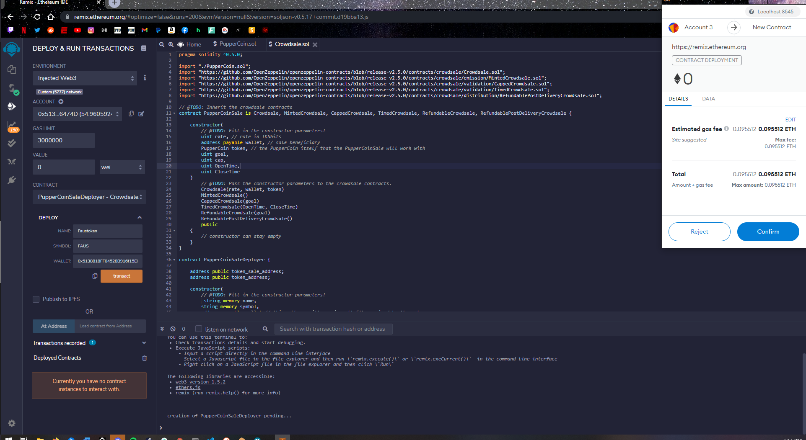
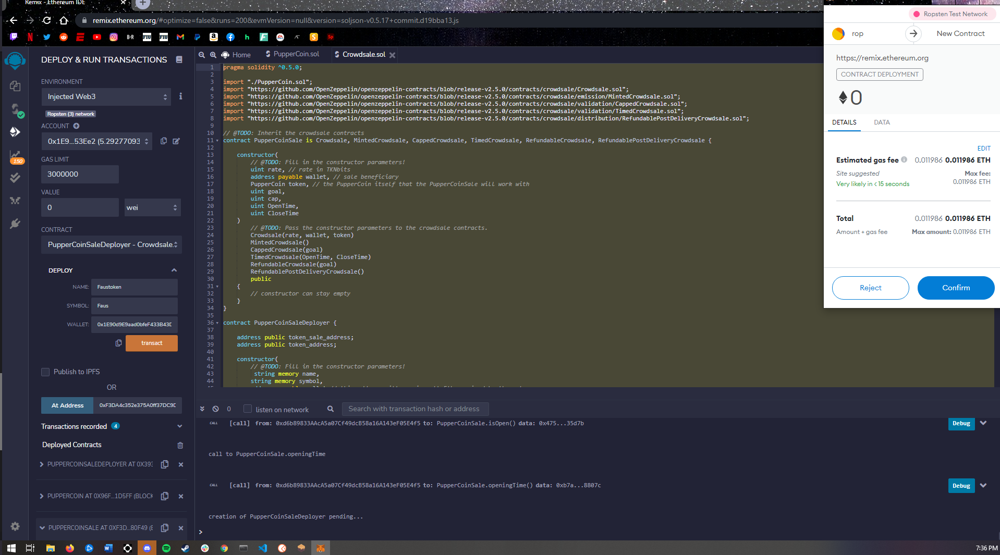
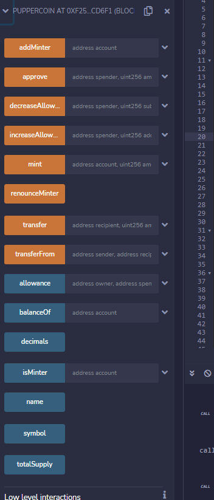
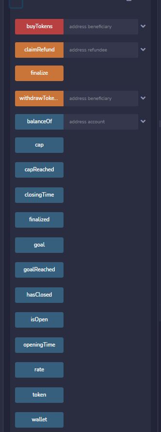
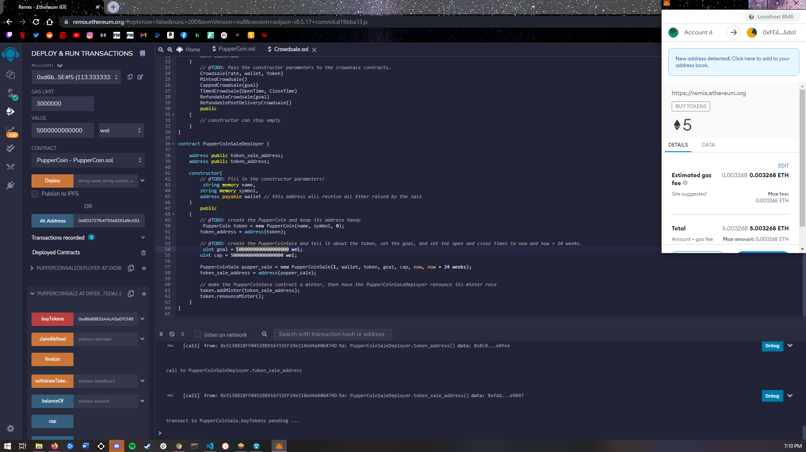
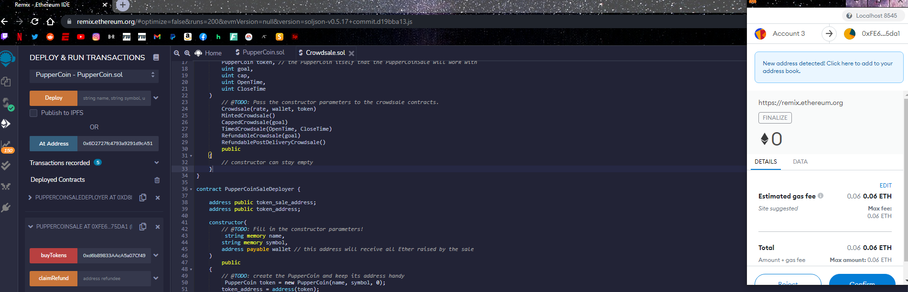
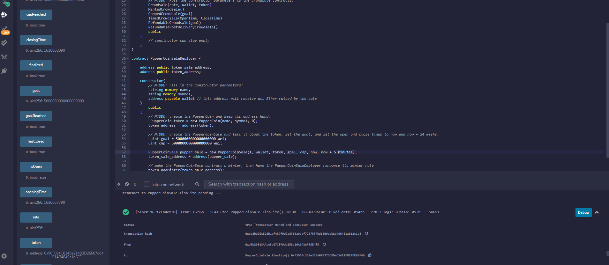
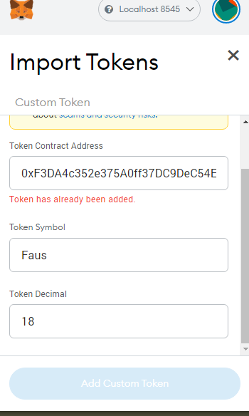
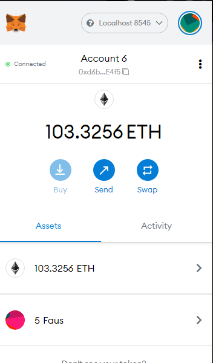

# **Faustoken Crowdsale**

## Background

This repository includes instructions and pictures of the deployment of a crowd sale token named *Faustoken* that is deployed on my private ganache network as a well as Ropsten. Below you will see the succeful delpoyment of the contract as well as a new account buying 5 ether(crowdsale cap) to bring the contract to completion. Since this was on a test network we only wanted to raise 5 ether to show that it works. 

You will need to create an ERC20 token that will be minted through a `Crowdsale` contract that you can leverage from the OpenZeppelin Solidity library.

This crowdsale contract will manage the entire process, allowing users to send ETH and get back PUP (PupperCoin).
This contract will mint the tokens automatically and distribute them to buyers in one transaction.

It will need to inherit `Crowdsale`, `CappedCrowdsale`, `TimedCrowdsale`, `RefundableCrowdsale`, and `MintedCrowdsale`.

You will conduct the crowdsale on the Kovan or Ropsten testnet in order to get a real-world pre-production test in.

## Instructions

### Creating your own contract

Using Remix, create a file called `PupperCoin.sol` and create a standard `ERC20Mintable` token. Since you're already an expert at this, you can simply use this [starter code](../Starter-Code/PupperCoin.sol).

Create a new contract named `PupperCoinCrowdsale.sol`, and prepare it like a standard crowdsale.

### Designing the contracts

#### ERC20 PupperCoin

You will need to simply use a standard `ERC20Mintable` and `ERC20Detailed` contract, hardcoding `18` as the `decimals` parameter, and leaving the `initial_supply` parameter alone.

You don't need to hardcode the decimals, however since most use-cases match Ethereum's default, you may do so.

Simply fill in the `PupperCoin.sol` file with this [starter code](../Starter-Code/PupperCoin.sol), which contains the complete contract you'll need to work with in the Crowdsale.

#### PupperCoinCrowdsale

Leverage the [Crowdsale](../Starter-Code/Crowdsale.sol) starter code, saving the file in Remix as `Crowdsale.sol`.

You will need to bootstrap the contract by inheriting the following OpenZeppelin contracts:

* `Crowdsale`

* `MintedCrowdsale`

* `CappedCrowdsale`

* `TimedCrowdsale`

* `RefundablePostDeliveryCrowdsale`

You will need to provide parameters for all of the features of your crowdsale, such as the `name`, `symbol`, `wallet` for fundraising, `goal`, etc. Feel free to configure these parameters to your liking.

You can hardcode a `rate` of 1, to maintain parity with Ether units (1 TKN per Ether, or 1 TKNbit per wei). If you'd like to customize your crowdsale rate, follow the [Crowdsale Rate](https://docs.openzeppelin.com/contracts/2.x/crowdsales#crowdsale-rate) calculator on OpenZeppelin's documentation. Essentially, a token (TKN) can be divided into TKNbits just like Ether can be divided into wei. When using a `rate` of 1, just like 1000000000000000000 wei is equal to 1 Ether, 1000000000000000000 TKNbits is equal to 1 TKN.

Since `RefundablePostDeliveryCrowdsale` inherits the `RefundableCrowdsale` contract, which requires a `goal` parameter, you must call the `RefundableCrowdsale` constructor from your `PupperCoinCrowdsale` constructor as well as the others. `RefundablePostDeliveryCrowdsale` does not have its own constructor, so just use the `RefundableCrowdsale` constructor that it inherits.

If you forget to call the `RefundableCrowdsale` constructor, the `RefundablePostDeliveryCrowdsale` will fail since it relies on it (it inherits from `RefundableCrowdsale`), and does not have its own constructor.

When passing the `open` and `close` times, use `now` and `now + 24 weeks` to set the times properly from your `PupperCoinCrowdsaleDeployer` contract.

#### PupperCoinCrowdsaleDeployer

In this contract, you will model the deployment based off of the `ArcadeTokenCrowdsaleDeployer` you built previously. Leverage the [OpenZeppelin Crowdsale Documentation](https://docs.openzeppelin.com/contracts/2.x/crowdsales) for an example of a contract deploying another, as well as the starter code provided in [Crowdsale.sol](../Starter-Code/Crowdsale.sol).
### Token Deployed on Ganache

ganche token sale address: 0xF3DA4c352e375A0ff37DC9DeC54E1FDE7FE80F49
ganach token adreess : 0x96F894C6240a2148BD25567d6451A74849a1d5FF
### Token Deployed on Ropsten

ropsten  token address: 0x09e4A34FB79A6Df651Ff891fa77b42B1604D3dAE
ropsten sale address: 0xEbb37f5d77A147Ab379c87e2Fc2FA6d809680DBd

### Testing the Crowdsale

Test the crowdsale by sending Ether to the crowdsale from a different account (**not** the same account that is raising funds), then once you confirm that the crowdsale works as expected, try to add the token to MyCrypto and test a transaction. You can test the time functionality by replacing `now` with `fakenow`, and creating a setter function to modify `fakenow` to whatever time you want to simulate. You can also set the `close` time to be `now + 5 minutes`, or whatever timeline you'd like to test for a shorter crowdsale.
### Illustrating token sale

When sending Ether to the contract, make sure you hit your `goal` that you set, and `finalize` the sale using the `Crowdsale`'s `finalize` function. In order to finalize, `isOpen` must return false (`isOpen` comes from `TimedCrowdsale` which checks to see if the `close` time has passed yet). Since the `goal` is 300 Ether, you may need to send from multiple accounts. If you run out of prefunded accounts in Ganache, you can create a new workspace.
### Illustrating finalizing the token

### Proof that the crowdsale has ended

Remember, the refund feature of `RefundablePostDeliveryCrowdsale` only allows for refunds once the crowdsale is closed **and** the goal is met. See the [OpenZeppelin RefundableCrowdsale](https://docs.openzeppelin.com/contracts/2.x/api/crowdsale#RefundableCrowdsale) documentation for details as to why this is logic is used to prevent potential attacks on your token's value.

You can add custom tokens in Metamask from the `import  tokens` feature:

